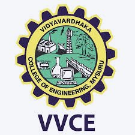

<div align="center">



# VVCE TimeTable

### Vidya Vardhaka College of Engineering, Mysuru

**2nd Semester · Computer Science & Engineering · Section G**

[](https://flutter.dev)
[](https://dart.dev)
[](https://developer.android.com)
[](https://web.dev/progressive-web-apps/)
[](LICENSE)
[](https://github.com)

---

*A beautifully crafted, production-grade timetable app built with Flutter — available on Android and as a Web PWA for iPhone users.*

</div>

---

## 📖 About the App

**VVCE TimeTable** is a smart, personalised academic timetable application built exclusively for students of **Vidya Vardhaka College of Engineering (VVCE), Mysuru** — specifically for the **2nd Semester, CSE, Section G (C-Cycle, w.e.f 23.02.2026)**.

The app was developed to solve a real problem faced by students — keeping track of daily class schedules, knowing which class is happening right now, and getting timely reminders before each period. Instead of carrying a printed timetable or constantly checking WhatsApp, students can simply open the app and see exactly what's happening and what's next.

The app validates every login against the official Section G student list, ensuring only enrolled students can access the timetable. It is group-aware (G1 / G2 / G3), meaning it automatically shows the correct faculty and classroom based on the student's assigned group — especially useful for lab sessions where different groups have different rooms and instructors.

> Built with ❤️ for the students of VVCE Mysuru by **Nitin Mahadev B K** — 4TV25CS131, Section G.

---

## ✨ Features

### 🔐 Authentication & Security
- **Official student validation** — Login only works if your Name + USN exactly match the official Section G student list (all 64 students across G1, G2, G3)
- **1 Account = 1 Device** — Device fingerprinting (SHA-256 hashed) prevents the same account from being logged in on multiple devices simultaneously
- **Auto group assignment** — G1 / G2 / G3 is automatically determined from your USN — no manual selection needed
- **Persistent sessions** — Stay logged in across app restarts using SharedPreferences

### 📅 Smart Timetable
- **Live "NOW" indicator** — A pulsing green badge highlights the currently ongoing class in real time
- **Auto today tab** — The app always opens on the current weekday's schedule
- **Group-aware content** — Wednesday Chemistry Lab shows the correct faculty and room number based on your group (G1→G-202, G2→G-201, G3→G-003)
- **Swipe navigation** — Swipe left/right between days or tap the day tabs
- **Correct timings** — All slots reflect the official C-Cycle timetable including Tea Break (10:00–10:30) and Lunch (12:30–13:30)
- **Multi-faculty support** — Cards for Communicative Skills and Lab sessions correctly display all assigned faculty names

### 🔔 Smart Notifications
- **5-minute class reminders** — Get notified 5 minutes before every class starts
- **Break reminders** — Also notified 5 minutes before Tea Break (☕) and Lunch Break (🍽️) so you know when to wrap up
- **Works when app is closed** — Uses `zonedSchedule` with exact alarms, not just in-app timers — notifications fire even if the app is killed
- **India timezone** — Correctly uses `Asia/Kolkata` timezone for all scheduled notifications

### 🎨 UI & Experience
- **Material 3 Design** with subject-coded colours and icons for instant visual recognition
- **Dark / Light mode** toggle — preference saved and restored across sessions
- **Smooth animations** — Page transitions, card reveals, pulsing indicators, and scale effects
- **Weekly Stats panel** — Toggleable subject count overview showing how many times each subject appears in the week
- **Real VVCE logo** — The official college emblem used as the app icon, splash screen logo, and dashboard header
- **Portrait locked** — Consistent layout on all Android screen sizes
- **Built by banner** — Splash screen credits the developer

### 🌐 Web PWA (iPhone Users)
- A fully functional **Progressive Web App** hosted on GitHub Pages
- Works in Safari on iPhone — no App Store, no IPA required
- All 64 students validated, complete timetable, dark mode, live indicator
- **"Add to Home Screen"** support — installs like a native iPhone app
- **Offline capable** — Service Worker caches the app for use without internet

---

## 📱 App Screens

| Screen | Description |
|--------|-------------|
| **Splash** | Animated VVCE logo on deep blue gradient, version number, "Built by Nitin Mahadev" |
| **Login** | Student name + USN validation, section frozen to G, group auto-assigned, fictional example hints |
| **Timetable** | Day tabs, subject cards with icons and colours, live NOW badge, student info bar, dark mode |

---

## 🗂️ Timetable — Section G (C-Cycle, 12.02.2026)

| Day | Schedule |
|-----|---------|
| **Monday** | AI (9–10) → Tea → Python (10:30–11:30) → Chemistry (11:30–12:30) → Lunch → Communicative Skills (13:30–15:30) |
| **Tuesday** | Maths (8–9) → Chemistry (9–10) → Tea → **Maths Lab** (10:30–12:30) → Lunch → Electronics (13:30–14:30) → Python (14:30–15:30) |
| **Wednesday** | Maths (8–9) → Electronics (9–10) → Tea → **Chemistry Lab** (10:30–12:30) *(group-specific)* |
| **Thursday** | Kannada (9–10) → Tea → AI (10:30–11:30) → Electronics (11:30–12:30) → Lunch → Chemistry (13:30–14:30) → Maths (14:30–15:30) |
| **Friday** | **Python Lab** (8–10) → Tea → Maths (10:30–11:30) → Python (11:30–12:30) → Lunch → **Project Lab** (13:30–15:30) |

---

## 🎨 Subject Colour Coding

| Subject | Code | Icon | Colour |
|---------|------|------|--------|
| Applied Mathematics | 1BMATS201 | 🧮 | Purple |
| Applied Chemistry | 1BCHES202 | 🔬 | Teal |
| Python Programming | 1BPLCS203 | 💻 | Blue |
| Intro to Electronics | 1BIECK205 | ⚡ | Red |
| AI & Applications | 1BAIAK204 | 🤖 | Orange |
| Communicative Skills | 1BENGK208 | 📖 | Green |
| Samskruthika Kannada | 1BKSKK210 | 🔤 | Pink |
| Labs (all) | Various | 🧬 | Brown |
| Project-Based Learning | 1BPBLK209 | 🔧 | Brown |

---

## 🗂️ Project Structure

```
vvce_timetable/
├── lib/
│   ├── main.dart                        # App entry point, notification init
│   ├── data/
│   │   ├── timetable_data.dart          # Full Section G schedule (daySchedules map)
│   │   └── student_data.dart            # Official 64-student database + validateStudent()
│   ├── models/
│   │   └── timetable_model.dart         # ClassSlot, BreakEntry, SubjectType enum
│   ├── screens/
│   │   ├── splash_screen.dart           # Animated splash with device-lock check
│   │   ├── login_screen.dart            # Validated login with bulletproof navigation
│   │   └── timetable_screen.dart        # Dashboard with live indicator + group logic
│   ├── utils/
│   │   ├── app_theme.dart               # Material 3 theme, subject colours & icons
│   │   ├── prefs_service.dart           # SharedPreferences + device fingerprinting
│   │   └── notification_service.dart    # zonedSchedule background notifications
│   └── widgets/
│       ├── subject_card.dart            # Subject slot card with NOW badge
│       ├── day_selector.dart            # Animated horizontal day tab bar
│       ├── stats_widget.dart            # Weekly subject count chips
│       └── vvce_logo.dart               # Custom painted VVCE emblem
├── web/
│   ├── index.html                       # Full PWA web app for iPhone users
│   ├── manifest.json                    # PWA manifest (installable)
│   ├── service-worker.js               # Offline caching
│   └── icons/                           # VVCE logo web icons (192 & 512px)
├── android/                             # Android project files
│   └── app/src/main/res/mipmap-*/      # VVCE launcher icons (all densities)
├── assets/images/
│   └── vvce_logo.png                    # Official VVCE college logo
└── .github/workflows/
    └── build_apk.yml                    # CI/CD: Android APK + PWA deploy
```

---

## 🛠️ Tech Stack

| Layer | Technology | Purpose |
|-------|-----------|---------|
| **Framework** | Flutter 3.24 (Dart 3.0) | Cross-platform mobile app |
| **UI Design** | Material 3 + Custom Widgets | Beautiful, consistent interface |
| **Animations** | flutter_animate 4.5 | Smooth transitions and micro-interactions |
| **Typography** | Google Fonts — Poppins | Clean, modern typeface |
| **Persistence** | shared_preferences 2.2 | Login session, theme preference |
| **Notifications** | flutter_local_notifications 17 | Background class/break reminders |
| **Timezone** | timezone 0.9 | India (Asia/Kolkata) exact alarms |
| **Device ID** | device_info_plus 10 | Device fingerprinting for 1-device lock |
| **Security** | crypto 3.0 | SHA-256 hash of device fingerprint |
| **Web / PWA** | Vanilla HTML + CSS + JS | iPhone-compatible Progressive Web App |
| **CI/CD** | GitHub Actions | Auto APK build + GitHub Pages PWA deploy |

---

## 🚀 Installation

### Android (APK)

**Option 1 — Download from GitHub Actions (Recommended)**
1. Go to the **Actions** tab in this repository
2. Click the latest successful **"Build VVCE Timetable"** workflow run
3. Download **`VVCE_Timetable_Android_APK`** from the Artifacts section
4. On your Android phone → Settings → **Allow install from unknown sources**
5. Open the downloaded APK and tap **Install**

**Option 2 — Build locally**
```bash
# Prerequisites: Flutter 3.24+, Android SDK, Java 17
git clone https://github.com/YOUR_USERNAME/vvce_timetable.git
cd vvce_timetable
flutter pub get
flutter build apk --release
# APK saved to: build/app/outputs/flutter-apk/app-release.apk
```

**Option 3 — Run in development**
```bash
flutter pub get
flutter run
```

---

### iPhone / iOS (Web PWA)

No App Store needed — works directly in Safari:

1. Open **Safari** on your iPhone and go to:
   ```
   https://YOUR_USERNAME.github.io/vvce_timetable/
   ```
2. Tap the **Share** button (📤) at the bottom of Safari
3. Scroll down and tap **"Add to Home Screen"**
4. Tap **"Add"** in the top right
5. The app icon appears on your home screen — opens fullscreen like a native app! 🎉

> **Works offline** — once loaded, the Service Worker caches everything so you can view your timetable without internet.

---

### Run CI/CD (GitHub Actions)

Every push to `main` automatically:
- Builds a **Universal Android APK** (Ubuntu runner)
- Deploys the **Web PWA** to GitHub Pages (for iPhone users)

**Enable GitHub Pages** (one-time setup):
1. Go to your repo → **Settings** → **Pages**
2. Source: **Deploy from branch** → Branch: **`gh-pages`** → **Save**

**Create a versioned release:**
```bash
git tag v1.0.0
git push origin v1.0.0
# GitHub Release is created automatically with APK attached
```

---

## 📦 Dependencies

```yaml
# Core
flutter_animate: ^4.5.0              # Smooth animations & micro-interactions
google_fonts: ^6.1.0                 # Poppins typeface
shared_preferences: ^2.2.2          # Persistent login & settings storage

# Notifications (background-capable)
flutter_local_notifications: ^17.2.2 # Class & break reminders
timezone: ^0.9.4                      # India timezone for exact alarms

# Device Security
device_info_plus: ^10.1.0            # Device fingerprinting (1 account = 1 device)
crypto: ^3.0.3                        # SHA-256 hash for privacy-safe device ID

# Utilities
intl: ^0.19.0                         # Date & time formatting
lottie: ^3.0.0                        # Lottie animation support
```

---

## 👨‍💻 Developer

<div align="center">

**Nitin Mahadev B K**

*Student, Computer Science & Engineering*
*2nd Semester, Section G — Group G1*

**USN:** 4TV25CS131

**College:** Vidya Vardhaka College of Engineering, Mysuru

[](https://github.com/YOUR_USERNAME)

</div>

---

## 🏛️ About VVCE

**Vidya Vardhaka College of Engineering (VVCE)**
Mysuru, Karnataka, India

Established with the vision of imparting quality technical education, VVCE is one of the premier engineering colleges in Karnataka, affiliated to Visvesvaraya Technological University (VTU). The Computer Science & Engineering department prepares students with a strong foundation in computing, programming, and emerging technologies.

---

## 📄 License

```
MIT License

Copyright (c) 2025 Nitin Mahadev B K

Permission is hereby granted, free of charge, to any person obtaining a copy
of this software and associated documentation files (the "Software"), to deal
in the Software without restriction, including without limitation the rights
to use, copy, modify, merge, publish, distribute, sublicense, and/or sell
copies of the Software, and to permit persons to whom the Software is
furnished to do so, subject to the following conditions:

The above copyright notice and this permission notice shall be included in all
copies or substantial portions of the Software.

THE SOFTWARE IS PROVIDED "AS IS", WITHOUT WARRANTY OF ANY KIND, EXPRESS OR
IMPLIED, INCLUDING BUT NOT LIMITED TO THE WARRANTIES OF MERCHANTABILITY,
FITNESS FOR A PARTICULAR PURPOSE AND NONINFRINGEMENT.
```

---

<div align="center">

Made with ❤️ for VVCE Mysuru · Section G · 2025–26

*"Education is not the filling of a bucket, but the lighting of a fire."*

</div>
